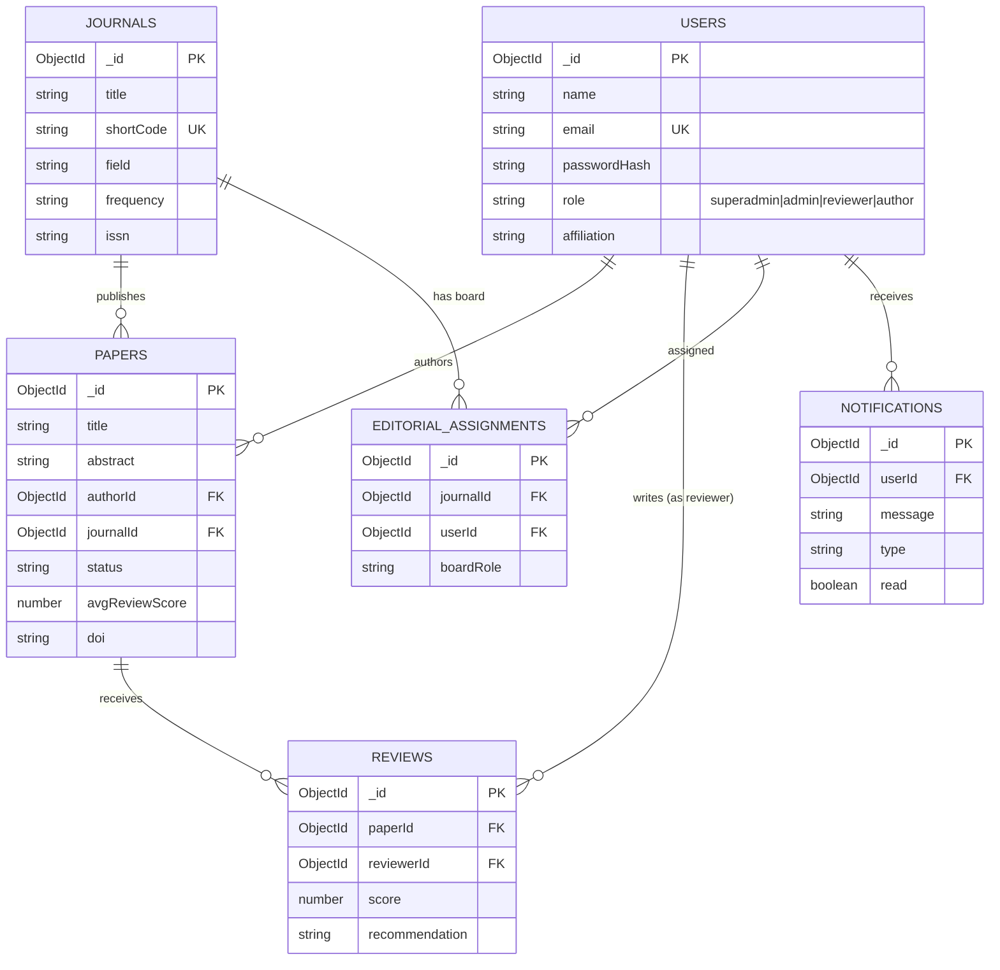

# ER Diagram — MAH Research Journal Portal

MongoDB is document-oriented, but the design below follows exactly the same
relational discipline your DBMS course expects: every "table" (collection)
has a primary key (`_id`), foreign keys are explicit ObjectId references,
and a many-to-many relationship is resolved with its own join collection
(`editorialassignments`) — never with duplicated arrays.

## Entities and relationships

## Cardinalities (plain English, for the viva)

| Relationship | Type | Enforced by |
|---|---|---|
| User → Papers | 1‑to‑many | `papers.authorId` |
| Journal → Papers | 1‑to‑many | `papers.journalId` |
| Paper → Reviews | 1‑to‑many | `reviews.paperId` |
| User (reviewer) → Reviews | 1‑to‑many | `reviews.reviewerId` |
| Journal ↔ User (editors) | many‑to‑many | `editorialassignments` join collection |
| User → Notifications | 1‑to‑many | `notifications.userId`, populated only by **triggers** |

## How to render this for your report

1. Paste the `mermaid` block above into https://mermaid.live and export as PNG, **or**
2. Open this file in VS Code / any Markdown viewer with Mermaid support and screenshot it, **or**
3. Ask me to render it as an image and I'll generate one directly.
